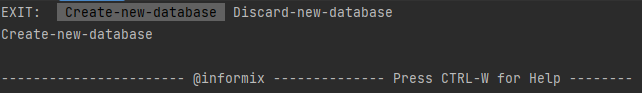

# Assessing data access layer

Welcome to the bachelor project of Group 3. 

The purpose of the project is to simulate different shipment loads on Postgresql and Informix using JDBC, JPA and JOOQ.

This project uses branches to separate the different frameworks and database connections.

In order to run the application you will need to be on the correct branch:

For Informix:

JPA: git checkout informixJPA

JDBC: git checkout informix/JDBCJPA

For Postgres:

JPA: git checkout postgresql/springjpa

JDBC: git checkout postgresql/JDBCJPA

JOOQ: git checkout JOOQSimpleSimulation

## Requirements:

Before being able to run any simulation on the frameworks, the databases need to be configured and set up.

### Both:

The project was built using Intellij so some functions might not be the same on other IDEs.

Docker needs to be installed for the project to work.

Run mvn install within the api/ folder

If maven is not part of your path variables use maven tab in intellij and run it from the 'Execute Maven Goal'

Running 'mvn install' from the 'Execute Maven Goal'.

### Postgres:

Once maven is finished installing run 'docker-compose up --build' in your terminal.

This will build the project in the docker and run it using the configurations from the dockerfiles and docker-compose file.

Postgres should now be up and running on your docker.

### Informix:

Run 'docker-compose up --build' the docker will build and the database and run the frontend, but not the app image.
The database is considered unhealthy so the app needs to be started manually, but first we need to configure the database.

Start a new terminal instance while the docker database is running.

Run 'docker exec -it bachelor-gruppe-3-database-1 bash'
Note that if you rename the project or change the name of the docker image,
you will need to change the name to fit the changes in the format 'projectName-databaseImageName'.

Now your terminal should look like this:

run 'dbaccess', you will now be able to create a database server.

Select  'Database'

then 'Create'.

Write the name for the database server will have.  
We recommend 'informix' as this is the name used in the docker-compose file.

If you want to name the database server something different,
change the 'INFORMIXDB_SERVER' under 'environment' to your preferred name.

After naming the server select 'Log',

then 'Buffered_log'.

You can now select 'Exit' until you get to this screen:

Select 'Create-new-database'.

Informix is now configured and you can start the 'app-1' image from docker.